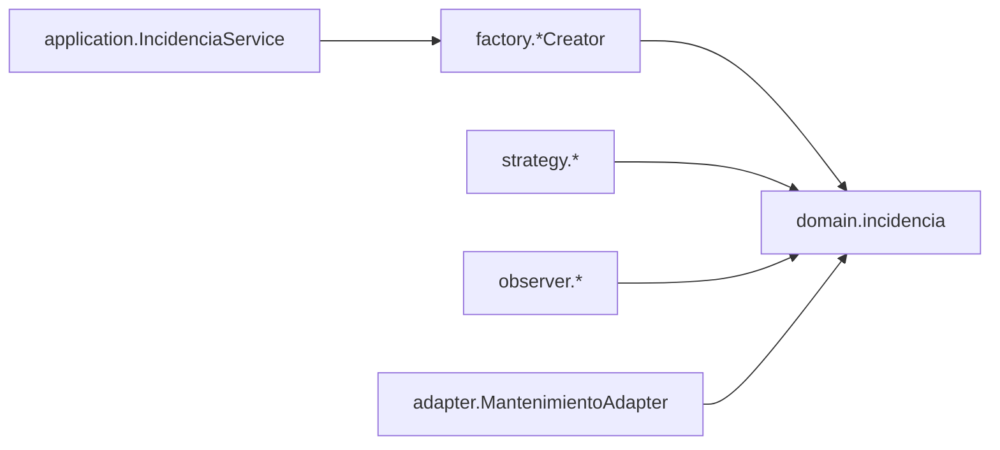

# Documento de arquitectura — CampusFix (Corte 2)

## 1. Descripción del sistema y resumen del Corte 1

CampusFix gestiona incidencias del campus (tecnología e infraestructura) y
será una función dentro de la App Sabana ("Reportar alerta"; la maqueta de la
interfaz está en `Interfaz_Arquitectura`). En el Corte 1 se diseñó el módulo
aplicando SOLID y cuatro patrones (ver `docs/factory-method.md`,
`docs/strategy.md`, `docs/adapter.md`): **Factory Method** (crear el tipo
correcto de incidencia), **Strategy** (tratamiento por tipo), **Adapter**
(sistema externo de mantenimiento) y **Observer** (avisos).

## 2. Retos asignados y trazabilidad

Ver la tabla en el [README](../README.md#tabla-de-trazabilidad).

## 3. Comparación de estilos y decisión

Matriz y justificación completas en
[ADR-001](adr/ADR-001-arquitectura-hexagonal.md). Resumen: se eligió
**hexagonal** (27/30) frente a capas (21), orientada a eventos (20) y
microservicios (15).

## 4. Arquitectura inicial (Corte 1) vs. evolucionada (Corte 2)

**Corte 1** — paquetes por patrón, sin persistencia ni entradas/salidas
reales; el servicio solo creaba objetos:



**Corte 2** — hexágono con puertos y adaptadores (diagramas C4 en
[diagramas/README.md](diagramas/README.md)). Cambios principales:

| Antes | Ahora |
|---|---|
| `adapter/` con un Adapter suelto | `adapter/in` (HTTP) y `adapter/out` (JDBC, notificación, QR, catálogo, mantenimiento); `MantenimientoAdapter` implementa el puerto `MantenimientoPuerto` |
| `IncidenciaService` solo creaba | orquesta clasificar → crear (Factory) → guardar → avisar (Observer), detrás de puertos de entrada |
| `Incidencia` sin estado | estado (`ABIERTA`, `EN_PROCESO`, `ESCALADA`, `RESUELTA`), fecha, validaciones y vencimiento |
| `IncidenciaSubject` frágil | tolerante a fallas por observador y seguro para hilos |
| — | `ClasificadorIncidencia` (Reto 2), `CodigoQr` + `ReporteQrService` (Reto 3), `SeguimientoService` + observers de alerta/correo (Reto 1) |

Estructura de paquetes (refleja el estilo):

```
com.campusfix
├─ domain          incidencia · clasificacion · catalogo · seguimiento · error
├─ factory  strategy  observer     (patrones del Corte 1, dependen solo de domain)
├─ application     casos de uso · port.in · port.out · observers
├─ adapter
│   ├─ in.http
│   └─ out.persistence · notification · qr · catalog · mantenimiento
└─ bootstrap       raíz de composición (único que conoce implementaciones)
```

Las reglas de dependencia las hace cumplir `ArquitecturaTest` (lee los
imports de `src/main`): el núcleo no importa aplicación/adaptadores ni SQL,
HTTP, JSON o ZXing; la aplicación no importa adaptadores; entrada y salida no
se conocen.

## 5. Cómo responde el diseño a cada reto

- **Reto 1 (que no queden en el olvido).** Al reportar, el `Subject` avisa a
  tres observers: alerta en la app (siempre), correo a TI (solo tecnología) y
  ticket a mantenimiento (solo infraestructura). Además `SeguimientoService`
  revisa lo pendiente: pasado el plazo por prioridad (ALTA 2 h, MEDIA 24 h,
  BAJA 72 h) escala la incidencia y avisa por app y correo al área. Un
  observer que falla no rompe el reporte ni a los demás.
- **Reto 2 (clasificación automática).** `ClasificadorPorReglas`: tipo por
  palabras clave (título pesa doble; empate o sin coincidencias →
  infraestructura) y prioridad por palabras críticas (ALTA), menores (BAJA) y
  ubicación sensible (laboratorio/biblioteca/auditorio sube MEDIA→ALTA).
  Detrás de la interfaz `ClasificadorIncidencia`.
- **Reto 3 (QR).** El QR solo lleva `campusfix://objeto/<ID>`; el catálogo
  resuelve qué es y dónde está, así que el usuario solo escanea (la
  descripción es opcional). `GET /qr/{id}.png` simula imprimir la etiqueta;
  `POST /incidencias/qr` acepta el texto leído o la imagen PNG.

## 6. Estrategia de pruebas

Ver [pruebas.md](pruebas.md).

## 7. Límites conocidos y trabajo pendiente para el Corte 3

- Correo y alertas son **simulados** (bandeja en memoria acotada a 10 000):
  falta un adaptador SMTP/push real.
- Los avisos son **síncronos** dentro de la petición; un notificador lento
  sube la latencia del reporte. Mitigación: cola asíncrona / hilo aparte.
- La clasificación por palabras clave **no entiende contexto** (p. ej.
  negaciones) ni sinónimos fuera de la lista; ante empate asume
  infraestructura. Falta medirla con un conjunto etiquetado de reportes reales.
- `POST /seguimiento/revisar` se dispara **a mano**; en producción debe ser un
  scheduler. Dos ejecuciones simultáneas podrían avisar dos veces la misma
  incidencia (no hay bloqueo).
- No hay autenticación, autorización ni identificación del reportante; el
  catálogo de objetos con QR es de ejemplo y en memoria.
- H2 en memoria: los datos se pierden al reiniciar. El repositorio abre una
  conexión por operación (sin pool), suficiente para la carga probada pero
  candidato a cuello de botella (ver resultados de carga).
- El Corte 3 automatizará esto en CI/CD con prácticas DevSecOps.
