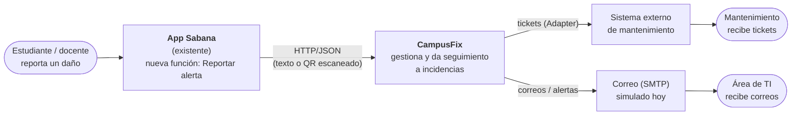
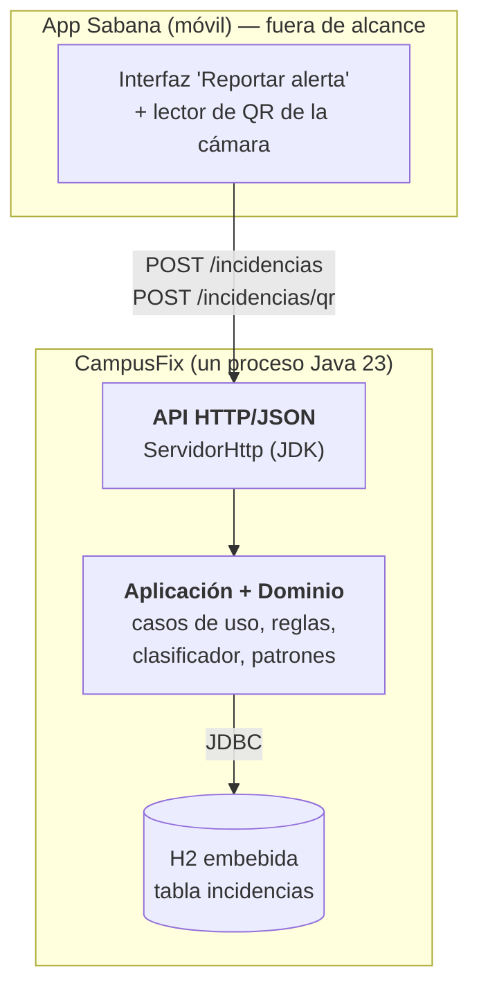
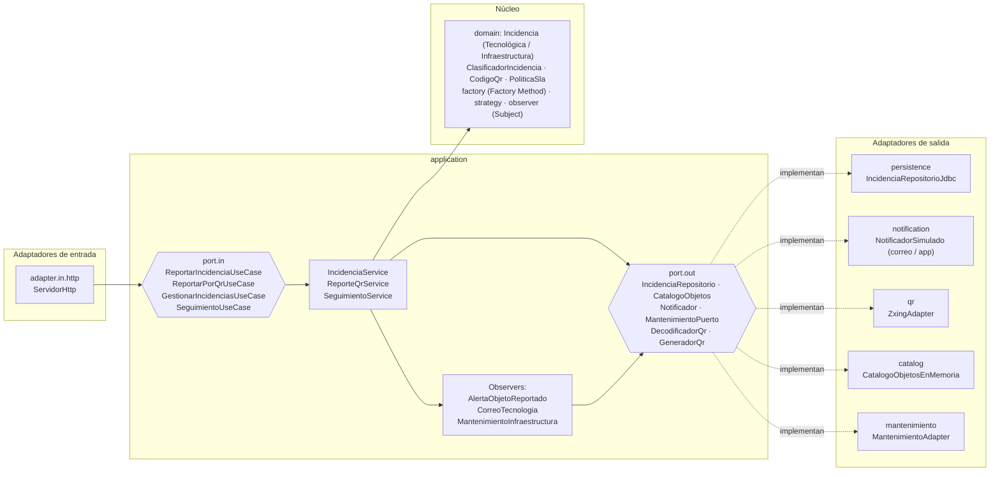
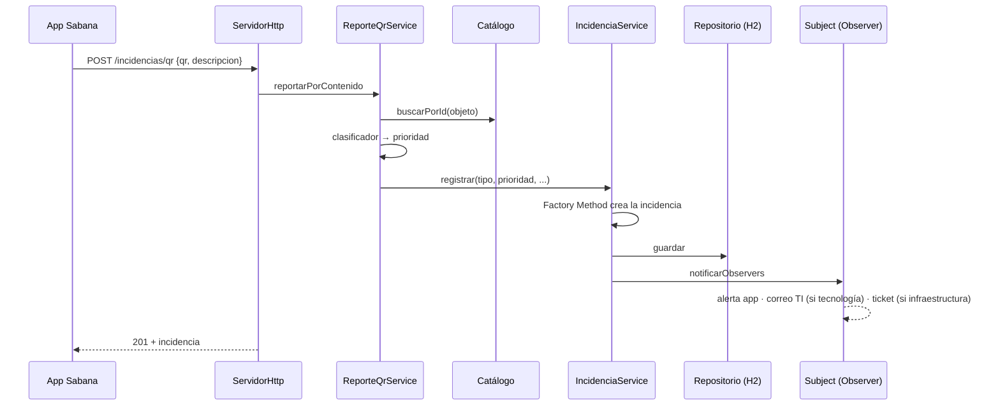

# Diagramas (C4 en Mermaid — GitHub los renderiza)

## Nivel 1: contexto

## Nivel 2: contenedores

## Nivel 3: componentes (hexágono)

## Flujo del reporte por QR (Reto 3 → 2 → 1)

Cada cierto tiempo `POST /seguimiento/revisar` (Reto 1) escala y avisa lo que
superó su plazo según la prioridad.
